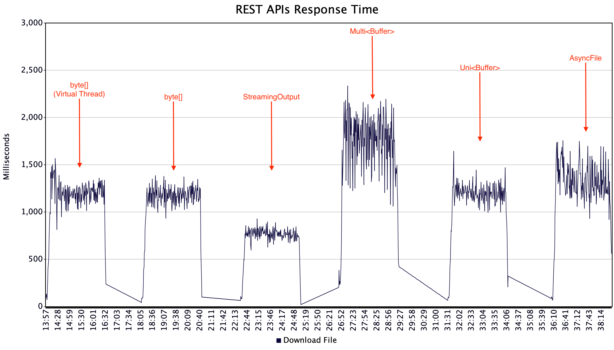

# Quarkus REST API File Download Benchmark

# Introduction
File downloading is a common operation in many applications. This project demonstrates various approaches to download files synchronously and asynchronously through REST APIs using [Quarkus](https://quarkus.io/). The performance of these approaches is measured and compared using [Apache JMeter](https://jmeter.apache.org/), a popular load testing tool.

# Why Quarkus?
Quarkus is a cloud-native Java framework that supports both **synchronous** and **asynchronous** programming models. With its reactive architecture, powered by [Vert.x](https://vertx.io/), Quarkus enables you to write non-blocking, high-performance REST endpoints. Quarkus integrates seamlessly with [Mutiny](https://smallrye.io/smallrye-mutiny/latest/), a reactive programming library, allowing the use of `Uni` and `Multi` types for asynchronous operations.

Additionally, Java 21 introduces Virtual Threads (Project Loom), which allow developers to write blocking-style code while maintaining the scalability of asynchronous approaches. Virtual Threads are lightweight, managed by the JVM, and ideal for concurrent workloads.

This project compares these file download approaches:
1. **Non-blocking (Reactive)** using `Uni<RestResponse<T>>`
2. **Blocking** using traditional `RestResponse<T>`
3. **Virtual Threads** to combine blocking code with scalability

The comparison focuses on **response time**, **throughput**, and **resource utilization**, helping you choose the best approach for your application.

## Exposed Endpoints

The application exposes the following REST endpoints for file downloading:

| Endpoint                            | Method | Description                                                                    | Return Type                     |
|-------------------------------------|--------|--------------------------------------------------------------------------------|---------------------------------|
| `/download/asynchFile/{name}`       | GET    | Downloads a file asynchronously as an `AsyncFile`.                             | `Uni<RestResponse<AsyncFile>>`  |
| `/download/asyncBuffer/{name}`      | GET    | Downloads a file asynchronously as a `Buffer`.                                 | `Uni<RestResponse<Buffer>>`     |
| `/download/asyncMultiBuffer/{name}` | GET    | Downloads a file asynchronously multiple `Buffer` as chunks.                   | `Multi<Buffer>`                 |
| `/download/stream/{name}`           | GET    | Streams the file content synchronously using a `StreamingOutput`.              | `RestResponse<StreamingOutput>` |
| `/download/byteArray/{name}`        | GET    | Downloads a file synchronously as a byte array.                                | `RestResponse<byte[]>`          |
| `/download/byteArrayVirtual/{name}` | GET    | Downloads a file asynchronously using Virtual Threads, returning a byte array. | `RestResponse<byte[]>`          |

# Requirements
To build and run this project, you need the following tools:
- **Java 21**
- **Maven 3**
- **Apache JMeter** (for performance testing)

# Building and Running the Application
Follow these steps to build and run the application locally:
1. Clone the repository.
2. To build the application, run the following command:
```shell
mvn clean package
```
3. Run the application with sufficient heap memory:
```shell
 java -Xms2g -Xmx2g -jar target/quarkus-app/quarkus-run.jar
```
**Optional**: You can containerize the application using Docker, but this is not required for running the performance tests.

## Preparing the Test Environment
To simulate a workload and test the performance of the REST endpoints, follow these steps:
### 1. Install Apache JMeter
Download JMeter from the [official website](https://jmeter.apache.org).
### 2. Generate Test Files
The performance tests require sample files of varying sizes to simulate real-world usage. To generate these files:
- Run the `SamplePDFFactory.java` class located in `src/test/java`.
- This class generates sample PDF files of different sizes: 1, 2, 5, 10 and 20 MB.
- Move the files to the folder where the application can access; the default is the `/tmp` directory.

**Note**: You can change the folder in the `application.properties` file.

### 3. Install JMeter Plugins
To extend JMeter's functionality, install the required plugins:
- Download and install the [JMeter Plugin Manager](https://jmeter-plugins.org/install/Install/).
- Using the Plugin Manager, install the **Concurrency Thread Group** plugin: [Concurrency Thread Group Documentation](https://jmeter-plugins.org/wiki/ConcurrencyThreadGroup/).

After installing the necessary plugins and configuring JMeter, you can execute the performance tests from the command line. You don't need to run the JMeter GUI during the tests.

**Note**: Close JMeter after plugin installation, as the test execution will be run via scripts from the terminal.

### 4. Load the JMeter Test Plan - optional
The JMeter test plan is located in the `src/perf` directory. It is preconfigured to:
- Simulate concurrent user requests, maxing out at 30 threads.
- Measure the performance of the different REST API endpoints.
- Runs for 2.5 minutes.
- Generate a summary report.


# Running the performance tests
To execute the performance tests for the REST API endpoints, run the following command from the `perf` directory:
```shell
./download_perf JMETER_HOME DOWNLOAD_SERVER_HOST DOWNLOAD_CONTEXT
```
where:
- `JMETER_HOME`: The path to your JMeter installation directory
- `DOWNLOAD_SERVER_HOST`: The hostname or IP address of the server where the application is running.
- `DOWNLOAD_CONTEXT`: The context path of the REST API endpoint you want to test. For example: `asyncFile`, `asyncBuffer`, `asyncMultiBuffer`, `stream`, `byteArray`, or `byteArrayVirtual`

# Test Results on Raspberry Pi 5
**Note**: I conducted the performance tests on a Raspberry Pi 5 with 8GB RAM and a 64-bit ARM processor, running both the application and JMeter on the same machine. For comparison, I also executed the tests on a MacBook Pro with an M1 chip, where I observed better throughput - results are not attached. However, the overall conclusions remained consistent across both environments.

* CPU usage was similar across all test cases, by downloading files as streams used the less CPU.
* Thread execution differed based on the endpoint type:
  * Async endpoints were executed on the **event loop threads**.
  * Blocking calls (`byteArray` and `stream`) ran on the **worker threads**.
  * `byteArrayVirtual` calls utilized **virtual threads**.
* Thread usage varied:
  * Async calls used the fewest threads, `asyncBuffer` used significantly fewer threads than other async endpoints.
  * Blocking calls required more threads.
  * Virtual threads fell somewhere in between.
* Heap memory usage:
  * The `asyncFile` endpoint used the most heap memory.
  * The `asyncMultiBuffer` and `stream` endpoints used similar memory.
  * The `asyncBuffer`, `byteArray`, and `byteArrayVirtual` endpoint used the least memory.
* Throughput:
  * The `stream` endpoint achieved the best throughput.
  * The `asyncMultiBuffer` endpoint had the lowest throughput.

| Endpoint         | Throughput (requests/second) |
|------------------|-----------------------------:|
| byteArrayVirtual |                         23.8 |
| byteArray        |                         24.6 |
| stream           |                         36.8 |
| asyncMultiBuffer |                         16.5 |
| asyncBuffer      |                         24.0 |
| asyncFile        |                         22.0 |

**Note**: Under the hood, the `byteArray` and `byteArrayVirtual` endpoints use the same implementation; in case of `asyncBuffer` the file content is loaded into the memory also. Do not use these methods to read very large files.

The following screenshot show result of the monitoring of the application using JMX JConsole.


The following screenshot shows the response time of the different endpoints.



# Disclaimer
This project is a proof of concept and focuses on showcasing different file download approaches using Quarkus. The performance tests simulate workloads on the REST endpoints for educational and comparison purposes. Results may vary based on hardware, network conditions, and other factors.
